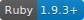

# Ruby Extended



[](https://creativecommons.org/licenses/by/4.0/)

Extends ruby classes with useful methods.

## Documentation
Documentation [available here](/documentation/readme.md).

## Installation
Add this line to your application's Gemfile:
```ruby
gem 'ruby_extended'
```
And then execute:
```bash
bundle
```
Or install it yourself as:
```bash
gem install ruby_extended
```
